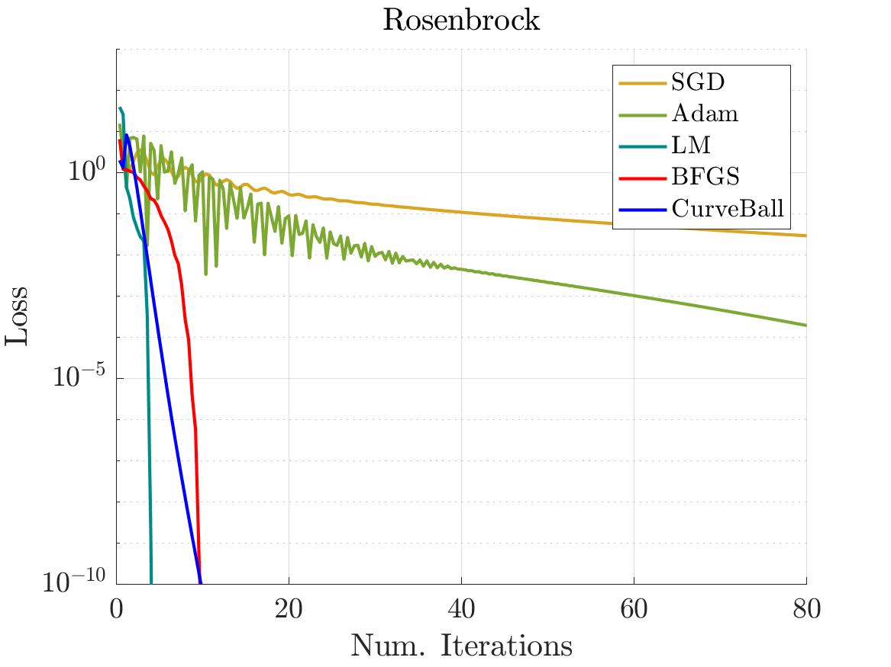
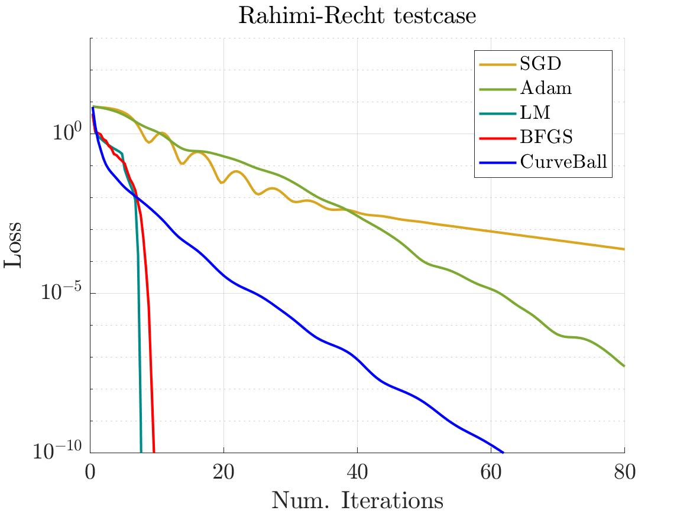

## mcnPathological


This small codebase contains some "toy" optimisation problems that exhibit pathological behaviour.  It has implementations for the [Rahimi-Recht](https://github.com/benjamin-recht/shallow-linear-net/blob/master/TwoLayerLinearNets.ipynb) problem, as various versions of the Rosenbrock function.  These are small-scale problems that we found useful while working on the [Curveball](https://github.com/jotaf98/curveball) solver.

To get up and running, the module can be installed via:

```
vl_contrib('install', 'mcnPathological') ;
vl_contrib('setup', 'mcnPathological') ;
```

Then to run some trials, you can run `launch_exp('dataset', 'rosenbrock', 'expType', 'blend-lite')`, to produce a figure comparing some solvers.  This is just a demo with some default set of parameters (you can get much better performance with grid searches if you wish to compare the methods more carefully).



or `launch_exp('dataset', 'rahimiRecht')` to get something like this:

